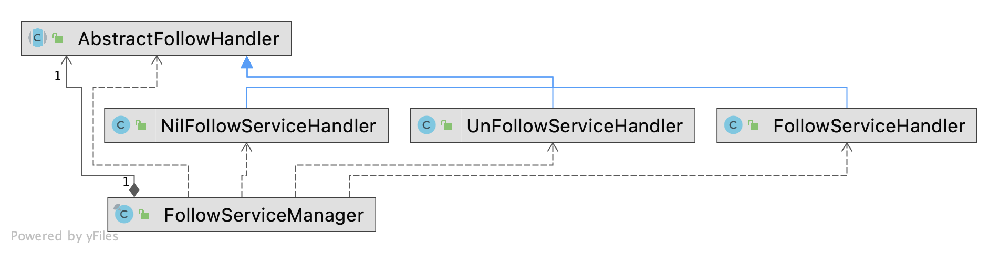

---

author: renfakai
layout: post
title: 58服务号关注关系
date: 2021-05-14
categories: 服务号
tags: [服务号]
description: 服务号

---

# 58服务号关注关系

### 关注关系分析
1.微信的好友关系，属于图中无向图，对于数据可以用邻接矩阵存储方法，如下如所示，即`[x,y]`和`[y,x]`相等都为1

| 0  | 1  |
|:---|:---|
| 1  | 0  |

2.微博好友关系为有向图，因为a关注了b，而b不一定关注a，而且微博存在大V情况，即存储结构与微信有些差异

| 0  | 1  |
|:---|:---|
| 0  | 0  |

3.使用邻接表存储方法存储数据，这个很像散列表,即数组+链表，（数组+红黑树）进行处理

### 58服务号关注关系
58服务号定位为与微信文章，微博大V一样，即服务号下有10W+粉丝，而一个用户关注N个服务号(一般不会超过100)。

### 使用场景
1. 某个商家推送某种优惠给自己粉丝
2. app上展示自己是否关注某个服务号
### 数据结构设计
现设计a,b为服务号，1,2,3为用户</br>
1 follow a    star:b [1]
              follow:1[a]

1 follow b    star:b [1]
              follow:1[a,b]

2 follow a    star:b [1,2]
              follow:2[a]

这样在使用推送时候如果服务号a,推送数据（文章）就可以查找到自己所有粉丝，如下图，

用户在app，查看自己关注某个服务号时可以很快计算出来

### 对于关注关系代码
使用享元设计模式+策略设计模式进行编写

代码如下
1. 编写一个请求实体
```
type FollowRequest struct {
	PolicyType int
	UserId     string
	ServiceId  string
}
```
2. 进行协议制定
```
type AbstractFollowHandler interface {

	currentNodeHandler(f FollowRequest) bool

	handler(f FollowRequest) bool
}
```
3. 编写一个dispatcher，这样可以在对代码解耦合
```
var manager *FollowManager
var once sync.Once

type FollowManager struct {
	container map[int]AbstractFollowHandler
	NilObject AbstractFollowHandler
}

func newFollowManager() *FollowManager {
	once.Do(func() {
		manager = &FollowManager{
			container: make(map[int]AbstractFollowHandler, 0),
			NilObject: &NilFollowServiceHandler{},
		}
	})
	return manager
}

func (h *FollowManager) r(policy AbstractFollowHandler) {
	if policy == nil {
		return
	}
	helloManager := newFollowManager()
	helloManager.container[policy.currentNodeHandler()] = policy
}
```
4. 编写关注代码
```
type FollowServiceHandler struct {
}

func (f2 *FollowServiceHandler) currentNodeHandler() int {
	return 1
}

func (f2 *FollowServiceHandler) handler(f FollowRequest) bool {
	// 这里需要保证原子性
	// 可以分别catch Exception,如果其中一个出现异常先保存异常，回滚数据，在抛出异常
	fmt.Println("star:" + f.ServiceId + "新增加了关注者follow:" + f.UserId)
	fmt.Println("follow:" + f.UserId + "关注了star:" + f.ServiceId)

	return true
}

func (f2 *FollowServiceHandler) register() {
	newFollowManager().r(f2)
}

```
5. 取消关注
```
type UnFollowServiceHandler struct {
}

func (f2 *UnFollowServiceHandler) currentNodeHandler() int {
	return 0
}

func (f2 *UnFollowServiceHandler) handler(f FollowRequest) bool {
	// 这里需要保证原子性
	// 可以分别catch Exception,如果其中一个出现异常先保存异常，回滚数据，在抛出异常
	fmt.Println("star:" + f.ServiceId + "有关注者取消了关注follow:" + f.UserId)
	fmt.Println("follow:" + f.UserId + "取消关注了star:" + f.ServiceId)
	return true
}

func (f2 *UnFollowServiceHandler) register() {
	newFollowManager().r(f2)
}

```
6. 使用nilObject对象处理非法数据
```
type NilFollowServiceHandler struct {
}

func (f2 *NilFollowServiceHandler) currentNodeHandler() int {
	return -1
}

func (f2 *NilFollowServiceHandler) handler(f FollowRequest) bool {
	panic("您当前处理无法操作")
}

func (f2 *NilFollowServiceHandler) register() {
	newFollowManager().r(f2)
}
```
5. 对于Dispatcher进行转发
```
func (h *FollowManager) dispatcher(r FollowRequest) {
	handler := h.container[r.PolicyType]
	if handler != nil {
		handler.handler(r)
	} else {
		h.NilObject.handler(r)
	}
}
```

### 一年内出现的问题
1. 由于a关注b，未对之前状态做判断，即最终态是一致的，会导致用户的关注时候被覆盖，BI统计的数据不准确

